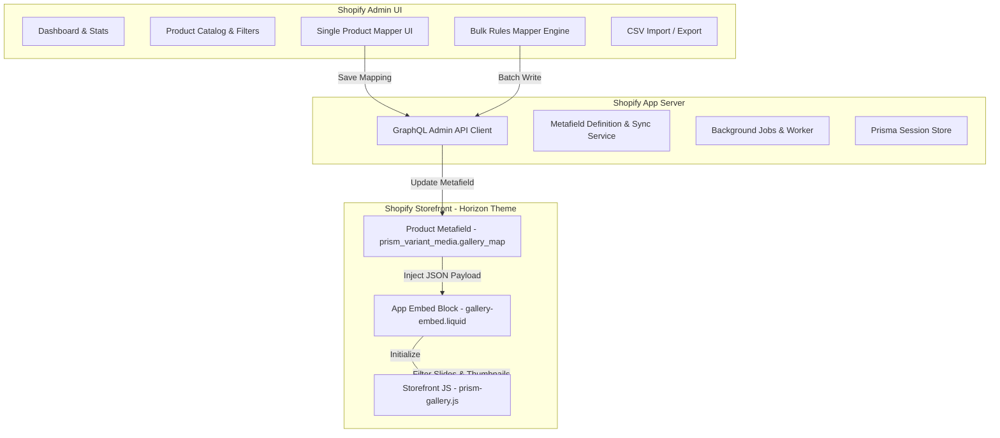

# System Architecture — Prism Variant Media

---

## Key Components

1. **Embedded Admin**: Built with Polaris and App Bridge v4 inside React Router.
2. **Product Metafields**: Serves as zero-latency storefront source of truth.
3. **Storefront Embed**: Non-intrusive Liquid app embed block. Does not alter theme Liquid files directly.
4. **Adapter Pattern**: Decouples DOM selection logic from storefront event handlers.
